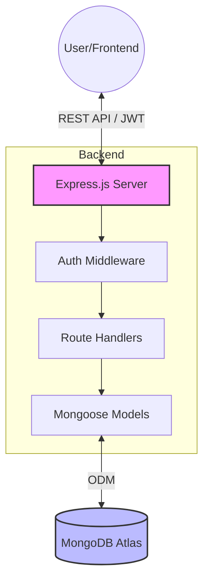
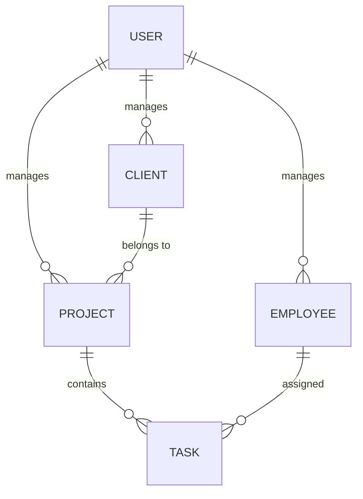

# Client Management SaaS Backend

A robust, scalable backend for a Client Management SaaS application, built with **Express**, **TypeScript**, and **MongoDB**. This project provides a full-featured API for managing clients, employees, projects, and tasks, complete with JWT-based authentication and secure session management.

## 📊 System Architecture



## 🚀 Features

-   **Authentication System**:
    -   Secure Login/Registration with password hashing (BcryptJS).
    -   JWT-based session management with Access and Refresh tokens.
    -   Secure cookie handling for tokens.
-   **Client Management**: CRUD operations for managing client profiles and their status.
-   **Employee Management**: Manage team members, roles, and attendance status.
-   **Project Oversight**: Track projects, budgets, timelines, and association with clients.
-   **Task Tracking**: Granular task management within projects, including status updates and assignments.
-   **Database Integration**: Seamless MongoDB integration using Mongoose with optimized schemas and indexing.
-   **Type Safety**: Built entirely with TypeScript for enhanced developer experience and code reliability.
-   **Deployment Ready**: Pre-configured for deployment on Vercel with serverless support.

## 🗄️ Data Relationships



## 🛠️ Tech Stack

-   **Runtime**: Node.js
-   **Framework**: Express (v5)
-   **Language**: TypeScript
-   **Database**: MongoDB (via Mongoose)
-   **Authentication**: JSON Web Tokens (JWT) & BcryptJS
-   **Development Tools**:
    -   `tsx`: For running TypeScript directly in development.
    -   `dotenv`: For environment variable management.
    -   `cors`: For handling cross-origin requests.

## 📂 Project Structure

```text
├── src/
│   ├── config/         # Environment configuration and constants
│   ├── middleware/     # Custom Express middleware (auth, db connection)
│   ├── models/         # Mongoose schemas and models
│   ├── routes/         # Express route handlers (auth, API endpoints)
│   ├── services/       # Business logic and seed services
│   ├── types/          # Global TypeScript type definitions
│   ├── utils/          # Utility functions
│   ├── app.ts          # Express app configuration
│   └── index.ts        # Server entry point
├── .env.example        # Template for environment variables
├── tsconfig.json       # TypeScript configuration
└── vercel.json         # Vercel deployment configuration
```

## 🚥 Getting Started

### Prerequisites

-   Node.js (v18 or higher recommended)
-   MongoDB instance (Local or Atlas)
-   npm or yarn

### Installation

1.  **Clone the repository**:
    ```bash
    git clone <repository-url>
    cd client-management-saas-backend
    ```

2.  **Install dependencies**:
    ```bash
    npm install
    ```

3.  **Environment Setup**:
    Copy the `.env.example` file to `.env` and fill in your credentials:
    ```bash
    cp .env.example .env
    ```
    *Make sure to update `MONGO_URI` and `ACCESS_TOKEN_SECRET`.*

### Available Scripts

-   **`npm run dev`**: Start the development server with hot-reloading using `tsx`.
-   **`npm run build`**: Compile the TypeScript code to JavaScript in the `dist` directory.
-   **`npm start`**: Run the compiled production server.

## 🔗 API Endpoints

### Auth Routes (`/auth`)
-   `POST /auth/login`: Authenticate user and receive tokens.
-   `POST /auth/register`: Create a new user account.
-   `POST /auth/logout`: Revoke sessions and clear cookies.
-   `POST /auth/refresh`: Obtain a new access token using a refresh token.

### Core API (`/api/...`)
-   **Clients**: `GET`, `POST`, `PUT`, `DELETE` at `/api/clients`
-   **Employees**: `GET`, `POST`, `PUT`, `DELETE` at `/api/employees`
-   **Projects**: `GET`, `POST`, `PUT`, `DELETE` at `/api/projects`
-   **Tasks**: `GET`, `POST`, `PUT`, `DELETE` at `/api/tasks`

### Utility
-   `GET /health`: Basic health check.
-   `GET /api/health`: Detailed health check including database status.

## ☁️ Deployment

This project is configured for **Vercel**. To deploy:

1.  Install Vercel CLI: `npm i -g vercel`
2.  Run `vercel` in the project root.
3.  Add your environment variables in the Vercel dashboard.

---

Built with ❤️ for scalable SaaS solutions.
